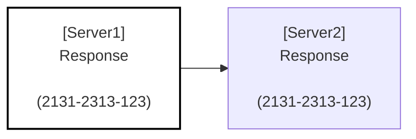

# go-proxy-mermaid

HTTP Proxy server used for demos

## Usage

### Env Vars

- `PORT`: Port to listen on (default: 8080)
- `PROXY_URL`: URL to proxy to (default: http://localhost:8081). Can be a comma-separated list of URLs to forward the request to multiple servers.
- `NAME`: Name of the server (default: proxy)

### Responses

#### JSON

#### HTML

Mermaid diagram with the chain of requests/responses:

